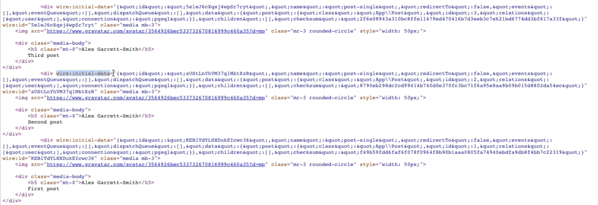

### Source code:
```
https://github.com/muhamed-didovic/livewire
```

### Tutorial on Github:
```
https://github.com/muhamed-didovic/obsidian-tutorials/tree/main/Getting%20started%20with%20Laravel%20Livewire
```

Livewire is a full-stack framework for Laravel that makes building dynamic interfaces simple, without leaving the comfort of Laravel.

-   Livewire renders the initial component output with the page (like a Blade include). This way, it's SEO friendly.
-   When an interaction occurs, Livewire makes an AJAX request to the server with the updated data.
-   The server re-renders the component and responds with the new HTML.
-   Livewire then intelligently mutates DOM according to the things that changed.

Here is the source code of livewire, in the image below there is wire-initial-data for the initialization of the livewire:
